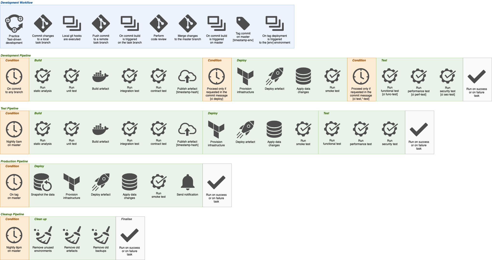
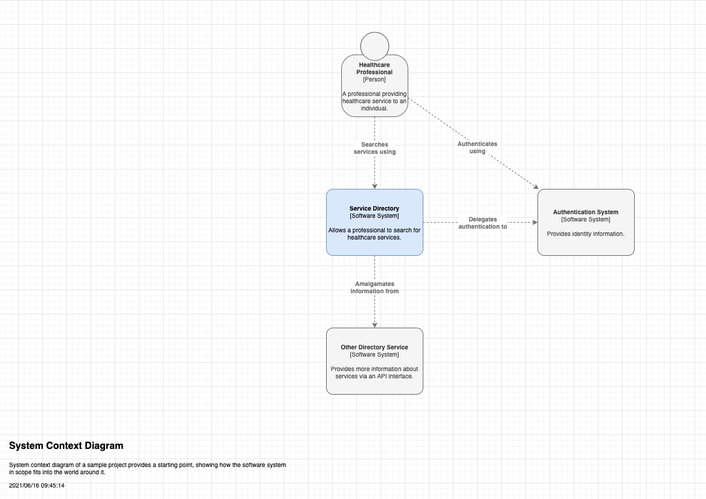
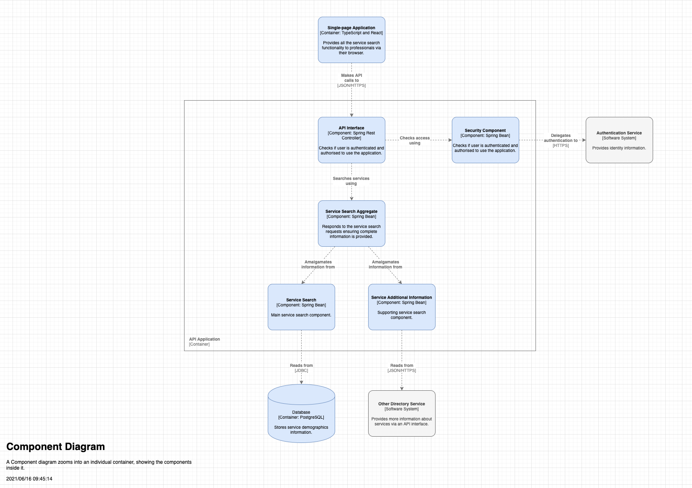

# PROJECT_NAME_TO_REPLACE

## Table of Contents

- [PROJECT_NAME_TO_REPLACE](#project_name_to_replace)
  - [Table of Contents](#table-of-contents)
  - [Overview](#overview)
  - [Quick Start](#quick-start)
    - [Development Requirements](#development-requirements)
    - [Local Environment Configuration](#local-environment-configuration)
    - [Local Project Setup](#local-project-setup)
  - [Contributing](#contributing)
  - [Development](#development)
    - [Code Formatting](#code-formatting)
    - [Code Quality](#code-quality)
  - [Testing](#testing)
    - [Unit Testing](#unit-testing)
    - [Component Testing](#component-testing)
    - [Integration Testing](#integration-testing)
    - [Test data and mock services](#test-data-and-mock-services)
    - [Manual check](#manual-check)
  - [Deployment](#deployment)
    - [Artefact Versioning](#artefact-versioning)
    - [CI/CD Pipelines](#cicd-pipelines)
    - [Deployment From the Command-line](#deployment-from-the-command-line)
      - [Quick Deployment](#quick-deployment)
    - [Remove Deployment From the Command-line](#remove-deployment-from-the-command-line)
    - [Secrets](#secrets)
    - [AWS Access](#aws-access)
  - [Architecture](#architecture)
    - [Diagrams](#diagrams)
      - [System Context Diagram](#system-context-diagram)
      - [Container Diagram](#container-diagram)
      - [Component Diagram](#component-diagram)
      - [Processes and Data Flow](#processes-and-data-flow)
      - [Infrastructure](#infrastructure)
      - [Networking](#networking)
    - [Integration](#integration)
      - [Interfaces](#interfaces)
      - [Dependencies](#dependencies)
    - [Data](#data)
    - [Authentication and authorisation](#authentication-and-authorisation)
    - [Technology Stack](#technology-stack)
    - [Key Architectural Decisions](#key-architectural-decisions)
    - [System Quality Attributes](#system-quality-attributes)
    - [Guiding Principles](#guiding-principles)
  - [Operation](#operation)
    - [Error Handling](#error-handling)
    - [Observability](#observability)
    - [Auditing](#auditing)
    - [Backups](#backups)
    - [Cloud Environments](#cloud-environments)
    - [Runbooks](#runbooks)
  - [Product](#product)
    - [Communications](#communications)
    - [Documentation](#documentation)

## Overview

A few sentences what business problem this project solves...

## Quick Start

### Development Requirements

- macOS operating system provisioned with the `curl -L bit.ly/make-devops-macos-setup | bash` command
- `iTerm2` command-line terminal and `Visual Studio Code` source code editor, which will be installed automatically for you in the next steps

### Local Environment Configuration

Clone the repository

    git clone [project-url]
    cd ./[project-dir]

The following is equivalent to the `curl -L bit.ly/make-devops-macos-setup | bash` command. If that step has already been done it can be omitted at this point

    make macos-setup

There are essential configuration options that **must** be set before proceeding any further. As a minimum the following command will ensure that tooling like `docker` and `git` are going to operate as expected, including local secret scanning and code formatting are enabled. Make sure you have `tx-mfa` into non-prod first before running `make setup`

    make setup

Please, ask one of your colleagues for the AWS account numbers used by the project. The next command will prompt you to provide them. This information can be sourced from a properly set up project by running `make show-configuration | grep ^AWS_ACCOUNT_ID_`

    make devops-setup-aws-accounts

Generate and trust a self-signed certificate that will be used locally to enable encryption in transit

    make trust-certificate

### Local Project Setup

    # Terminal 1
    make build
    make start log

## Contributing

Here is the list of the development practices that have to be followed by the team and the individual members:

- Only use single canonical branch **master**. Any intermediate branch significantly increases the maintenance overhead of the repository.
- Apply the git rebase workflow and never merge from master to a task branch. Follow the **squash-rebase-merge** pattern to keep the history linear and clean.
- Cryptographically sign your commits using **gpg** to ensure its content have not been tampered with.
- Format the summary message of your pull request (merge request) using the following pattern **"JIRA-XXX Summary of the change being made"** for complines and clarity as well as to enable tooling to produce release notes automatically.
- Announce your PR/MR on the development Slack channel to allow any team member to review it and to share the knowledge. A change can be merged only if all comments have been addressed and it has been **approved by at least one peer**. Make good use of paring/mobbing/swarming practices for collaborative coding.

Before starting any work, please read [CONTRIBUTING.md](documentation/CONTRIBUTING.md) for more detailed instructions.

## Development

- Describe how to
  - Connect to a local database
  - Interact with mock components
  - Switch each individual component to the dev mode
  - Reference the [TODO.md](documentation/TODO.md) file
  - Provide guidance on how to use feature toggles and branching by abstraction

### Code Formatting

  To format the code run:
    make python-code-format FILES=./application
    make python-code-format FILES=./test

### Code Quality

  To check the code quality run:
    make python-code-check FILES=./application
    make python-code-check FILES=./test

## Testing

List all the type of test suites included and provide instructions how to execute them

- Unit
- Component
- Integration
- Contract
- End-to-end
- Performance
- Security
- Smoke

How to run test suite in the pipeline

### Unit Testing

Unit testing is to test the functions within each lambda. This testing is done on the local system to where the commands are run e.g CLI, CI/CD Pipelines

This includes:This testing includes:

- Function calls
- Correct data types and data returned from function
- All paths tested of the application

This testing is generally done by a developer

To run unit tests run the following commands

    make python-requirements
    make unit-test

For coverage run

    make coverage-report

### Component Testing

Component Testing is to test the functional capabilities of the individual component(lambda). This testing is done on the local system to where the commands are run e.g CLI, CI/CD Pipelines

This testing includes:

- Logging
- Input & Output of component
- Calls to Mocks (DB/DoS API Gateway)
- Erroneous data passed into component
- Meets business needs of the ticket

This testing is generally done by a developer

To run components tests run the following commands

    make python-requirements
    make start component-test

### Integration Testing

Integration Testing is to test the functional capabilities of the individual component work together with mocks and partner services. Asserting that individual components can work in harmony together achieving the overall business goals.  This testing is done on AWS to test the connection between components.

This testing includes:

- Calls to Mocks (DoS API Gateway if required)
- Check data when passed between components
- Meets business needs of the application

This testing is generally done by a tester

### Test data and mock services

- How the test data set is produced
- Are there any mock services in place

### Manual check

Here are the steps to perform meaningful local system check:

- Log in to the system using a well known username role

## Deployment

### APIKey

API Key must be generated prior to external API-Gateways being set up.

### Artefact Versioning

E.g. semantic versioning vs. timestamp-based

### CI/CD Pipelines

List all the pipelines and their purpose

- Development
- Test
- Cleanup
- Production (deployment)

Reference the [jenkins/README.md](build/automation/lib/jenkins/README.md) file

  

### Deployment From the Command-line

    make docker-build NAME=serverless # (TMP) Build Serverless docker image
    make serverless-requirements # Install serverless plugins
    make build-and-deploy PROFILE=task # Builds docker images, pushes them and deploys to lambda

#### Quick Deployment

To quick update the lambdas run the following command. Note this only updates the lambdas and api-gateway

    make sls-only-deploy PROFILE=task VERSION=latest

### Remove Deployment From the Command-line

    make undeploy PROFILE=task # Builds docker images, pushes them and deploys to lambda
### Secrets

Where are the secrets located, i.e. AWS Secrets Manager, under the `$(PROJECT_ID)-$(PROFILE)/deployment` secret name and variable `$(DEPLOYMENT_SECRETS)` should be set accordingly.

### AWS Access

To be able to interact with a remote environment, please make sure you have set up your AWS CLI credentials and
MFA to the right AWS account using the following command

    tx-mfa

## Architecture

### Diagrams

#### System Context Diagram

Include an image of the [C4 model](https://c4model.com/) System Context diagram exported as a `.png` file from the draw.io application.

  

#### Container Diagram

Include an image of the [C4 model](https://c4model.com/) Container diagram exported as a `.png` file from the draw.io application.

  

#### Component Diagram

Include an image of the [C4 model](https://c4model.com/) Component diagram exported as a `.png` file from the draw.io application.

  

#### Processes and Data Flow

Include an image of the Processes and Data Flow diagram

#### Infrastructure

Include an image of the Infrastructure diagram. Please, be aware that any sensitive information that can be potentially misused either directly or indirectly must not be stored and accessible publicly. This could be IP addresses, domain names or detailed infrastructure information.

  

#### Networking

Include an image of the Networking diagram. Please, be aware that any sensitive information must not be stored and accessible publicly. This could be IP addresses, domain names or detailed networking information.

### Integration

#### Interfaces

Document all the system external interfaces

- API documentation should be generated automatically

#### Dependencies

Document all the system external dependencies and integration points

### Data

What sort of data system operates on and processes

- Data set
- Consistency and integrity
- Persistence

### Authentication and authorisation

- Default user login for testing
- Different user roles
- Authosrisation type
- Authentication method

It is recommended that any other documentation related to the aspect of security should be stored in a private workspace.

### Technology Stack

What are the technologies and programing languages used to implement the solution

### Key Architectural Decisions

Link or include the abbreviated list of the ADRs

### System Quality Attributes

- Accessibility, usability
- Resilience, durability, fault-tolerance
- Scalability, elasticity
- Consistency
- Performance
- Interoperability
- Security
- Supportability

### Guiding Principles

List of the high level principles that a product /development team must adhere to:

- The solution has to be coded in the open - e.g. NHSD GitHub org
- Be based on the open standards, frameworks and libraries
- API-first design
- Test-first approach
- Apply the automate everything pattern
- AWS-based cloud solution deployable to the NHSD CPaaS Texas platform
- Use of the Make DevOps automation scripts (macOS and Linux)

## Operation

### Error Handling

- What is the system response under the erroneous conditions

### Observability

- Logging
  - Indexes
  - Format
- Tracing
  - Correlation ID
- Monitoring
  - Dashboards
- Alerting
  - Triggers
  - Service status
- Fitness functions
  - What do we measure?

What are the links of the supporting systems?

### Auditing

Are there any auditing requirements in accordance with the data retention policies?

### Backups

- Frequency and type of the backups
- Instructions on how to recover the data

### Cloud Environments

List all the environments and their relation to profiles

- Dev
  - Profile: `dev`
- Demo
  - Profile: `demo`
- Live
  - Profile: `live`

To deploy a environment run `make deploy PROFILE=task`

### Runbooks

List all the operational runbooks

## Product

### Communications

- Slack channels
  - Development, e.g. `[service-name]-development`
  - CI/CD and data pipelines, processes, e.g. `[service-name]-automation`
  - Service status, e.g. `[service-name]-status`
- Email addresses in use, e.g. `[service.name]@nhs.net`

All of the above can be service, product, application or even team specific.

### Documentation

- Sprint board link

  <https://nhsd-jira.digital.nhs.uk/secure/RapidBoard.jspa?rapidView=3875>

  Note this sprint board requires permissions for both APU (PU project) and DI project

- Backlog link

  <https://nhsd-jira.digital.nhs.uk/secure/RapidBoard.jspa?rapidView=3875&view=planning&issueLimit=100>

- Roadmap

  <https://nhsd-confluence.digital.nhs.uk/display/DI/Roadmap>

- Risks register

  We have a risk register but not accessible/viewable by the development team. So if a new risk needs to be added the Delivery Manager is the best to talk to.

- Documentation workspace link

  Documentation is stored in the [documentation](documentation) folder

- Confluence

  A separate confluence space has been set up for the DoS Integration Project

  <https://nhsd-confluence.digital.nhs.uk/display/DI/DoS+Integration+Home>

- Definition of Ready/Done

  <https://nhsd-confluence.digital.nhs.uk/pages/viewpage.action?pageId=293247477>

- Ways of working

  <https://nhsd-confluence.digital.nhs.uk/display/DI/DI+Ways+of+Working>
