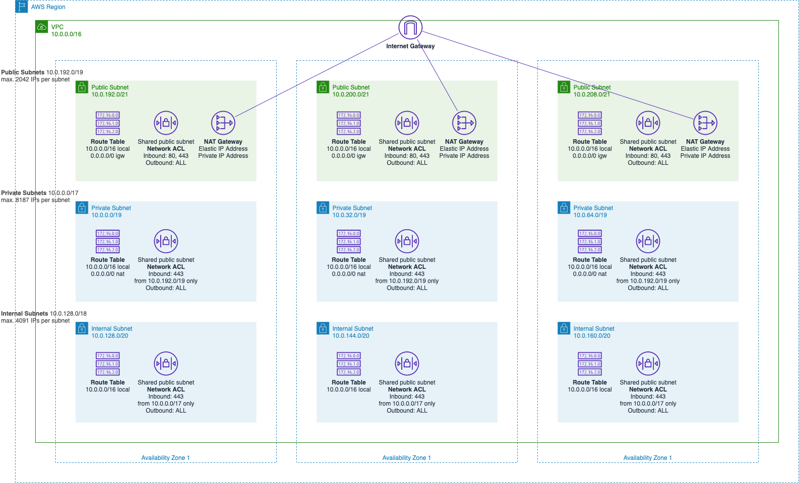

# Terraform Stack: `networking`

## Description

This stack provisions a Multi-AZ and multi-subnet VPC infrastructure with managed NAT gateways in the public subnet for each Availability Zone.

## Design

## Dependencies

- `terraform-state` stack
- This stack can be executed with any of the three profiles i.e. `tools`, `tools-nonprod` and `tools-prod` against the linked AWS account in each individual profile.
- A VPN network CIDR must be agreed and set prior to provisioning to avoid network addresses conflicts.

## Usage

### Create an operational stack from the template

    make project-create-profile NAME=tools
    make project-create-infrastructure MODULE_TEMPLATE=vpc,security-group,alb,acm,route53,ecs,appmesh,autoscaling,vpn STACK_TEMPLATE=networking PROFILE=tools

### Provision the stack

    make terraform-plan STACK=networking PROFILE=tools
    make terraform-apply-auto-approve STACK=networking PROFILE=tools

### Delegate the domain

Once the stack is created get the list of nameservers from the created hosted zone and add a corresponding DNS record of the NS type in the AWS `live-parent` account in the Texas Platform hosted zone with the NS servers of the created previously hosted zone. This should allow to pass the certificate validation.

### TODO

- Document domain and certificate setup
- Document load balancing setup
- Configure Route53 Health Checks
- Configure ALB Access Logs
- Extract web layer from the networking to its own stack

## Links

- [VPC - Architecture](https://docs.aws.amazon.com/quickstart/latest/vpc/architecture.html)
- [VPC - VPCs and subnets](https://docs.aws.amazon.com/vpc/latest/userguide/VPC_Subnets.html)
- [Route53 - NS and SOA records that Amazon Route 53 creates for a public hosted zone](https://docs.aws.amazon.com/Route53/latest/DeveloperGuide/SOA-NSrecords.html)
- [Route53 - Choosing between alias and non-alias records](https://docs.aws.amazon.com/Route53/latest/DeveloperGuide/resource-record-sets-choosing-alias-non-alias.html)
- [ALB - What is an Application Load Balancer?](https://docs.aws.amazon.com/elasticloadbalancing/latest/application/introduction.html)
