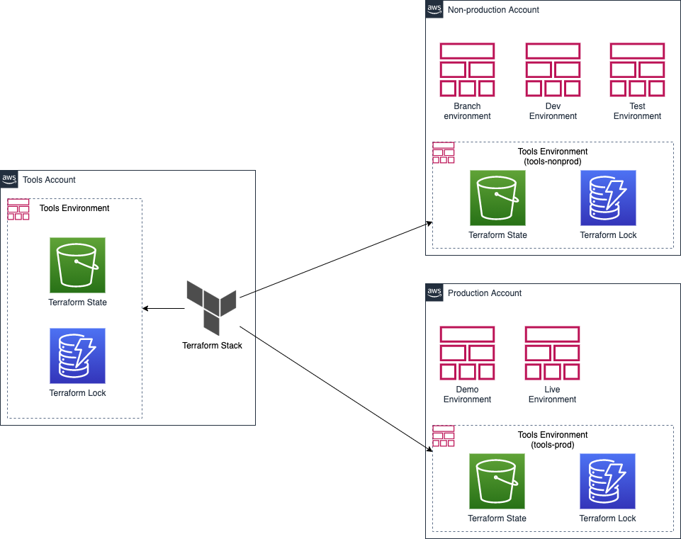

# Terraform Stack: `terraform-state`

## Description

This stack provisions S3 bucket and DynamoDB table to store the Terraform state of the corresponding infrastructure.

## Design

## Dependencies

- This stack can be executed with any of the three profiles i.e. `tools`, `tools-nonprod` and `tools-prod` against the linked AWS account in each individual profile.

## Usage

### Create an operational stack from the template

    make project-create-profile NAME=tools
    make project-create-infrastructure MODULE_TEMPLATE=s3,dynamodb STACK_TEMPLATE=terraform-state PROFILE=tools

### Provision the stack

    make terraform-plan STACK=terraform-state TERRAFORM_USE_STATE_STORE=false PROFILE=tools
    make terraform-apply-auto-approve STACK=terraform-state TERRAFORM_USE_STATE_STORE=false PROFILE=tools

### Store its own state

Now, having created the S3 bucket to store the state and DynamoDB table to acquire the lock, it is time to upload the local state.

    make terraform-apply-auto-approve STACK=terraform-state TERRAFORM_DO_NOT_REMOVE_STATE_FILE=true PROFILE=tools

You will be prompted with a question `Do you want to copy existing state to the new backend?`. Enter `yes` to copy the state into the S3 bucket and store it there.

### Configuration updates

Any later changes can be applied using the following

    make terraform-plan STACK=terraform-state PROFILE=tools
    make terraform-apply-auto-approve STACK=terraform-state PROFILE=tools

## Links

- [How to manage Terraform state](https://blog.gruntwork.io/how-to-manage-terraform-state-28f5697e68fa)
