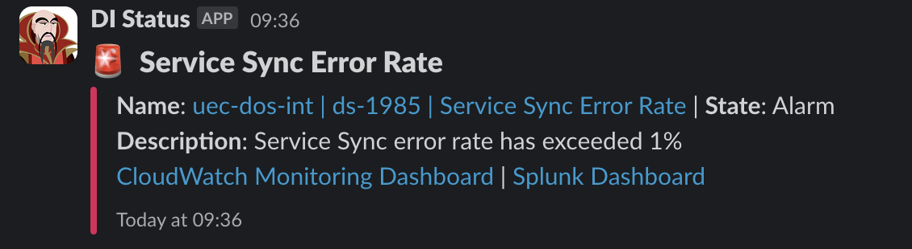

# Chaos engineering scenarios

## Table of contents

- [Chaos engineering scenarios](#chaos-engineering-scenarios)
  - [Table of contents](#table-of-contents)
  - [Ingest change event lambda issue](#ingest-change-event-lambda-issue)
    - [Description](#description)
    - [How did the development team discover the issue?](#how-did-the-development-team-discover-the-issue)
    - [Steps to gain more information about the issue](#steps-to-gain-more-information-about-the-issue)
    - [Application features to ensure data integrity](#application-features-to-ensure-data-integrity)
    - [How to fix the issue](#how-to-fix-the-issue)
  - [Service matcher lambda issue](#service-matcher-lambda-issue)
    - [Description](#description-1)
    - [How did the development team discover the issue?](#how-did-the-development-team-discover-the-issue-1)
    - [Steps to gain more information about the issue](#steps-to-gain-more-information-about-the-issue-1)
    - [Application features to ensure data integrity](#application-features-to-ensure-data-integrity-1)
    - [How to fix the issue](#how-to-fix-the-issue-1)
  - [Service sync lambda issue](#service-sync-lambda-issue)
    - [Description](#description-2)
    - [How did the development team discover the issue?](#how-did-the-development-team-discover-the-issue-2)
    - [Steps to gain more information about the issue](#steps-to-gain-more-information-about-the-issue-2)
    - [Application features to ensure data integrity](#application-features-to-ensure-data-integrity-2)
    - [How to fix the issue](#how-to-fix-the-issue-2)
  - [Slack Messenger lambda issue](#slack-messenger-lambda-issue)
    - [Description](#description-3)
    - [How did the development team discover the issue?](#how-did-the-development-team-discover-the-issue-3)
    - [Steps to gain more information about the issue](#steps-to-gain-more-information-about-the-issue-3)
    - [Application features to ensure data integrity](#application-features-to-ensure-data-integrity-3)
    - [How to fix the issue](#how-to-fix-the-issue-3)
  - [API Gateway 5XX issue](#api-gateway-5xx-issue)
    - [Description](#description-4)
    - [How did the development team discover the issue?](#how-did-the-development-team-discover-the-issue-4)
    - [Steps to gain more information about the issue](#steps-to-gain-more-information-about-the-issue-4)
    - [Application features to ensure data integrity](#application-features-to-ensure-data-integrity-4)
    - [How to fix the issue](#how-to-fix-the-issue-4)

## Ingest change event lambda issue

### Description

This is a breaking issue within the ingest change event lambda.

Examples of an issue could be:

- Incorrect environment variables
- Incorrect lambda permissions
- The lambda isn't able to save change events to the AWS DynamoDB database
- The lambda isn't able to send change events to the AWS SQS queue

### How did the development team discover the issue?

A slack alert arrived in the development team slack channel with the following message:

### Steps to gain more information about the issue

A slack alert arrived in the development team slack channel with the following message:
`Ingest Change Event Error Rate`

### Application features to ensure data integrity

### How to fix the issue

## Service matcher lambda issue

### Description

This is a breaking issue within the service matcher lambda.

Examples of an issue could be:

- Incorrect environment variables
- Incorrect lambda permissions
- The lambda isn't able to connect to the AWS Aurora Postgres database (DoS)
- The lambda isn't able to save/receive change events to the AWS SQS queue

### How did the development team discover the issue?

A slack alert arrived in the development team slack channel with the following message:
`Service Matcher Error Rate`

### Steps to gain more information about the issue

### Application features to ensure data integrity

### How to fix the issue

## Service sync lambda issue

### Description

This is a breaking issue within the service sync lambda.

Examples of an issue could be:

- Incorrect environment variables
- Incorrect lambda permissions
- The lambda isn't able to connect to the AWS Aurora Postgres database (DoS)
- The lambda isn't able to send/receive change events to the AWS SQS queue

### How did the development team discover the issue?

A slack alert arrived in the development team slack channel with the following message:
`Service Sync Error Rate`

### Steps to gain more information about the issue

### Application features to ensure data integrity

### How to fix the issue

## Slack Messenger lambda issue

### Description

This is a breaking issue within the slack message lambda.

Examples of an issue could be:

- Incorrect environment variables
- Incorrect lambda permissions
- The lambda isn't able to save/receive slack messages to the AWS SNS topic

### How did the development team discover the issue?

### Steps to gain more information about the issue

### Application features to ensure data integrity

### How to fix the issue

## API Gateway 5XX issue

### Description

This is a breaking issue with the API Gateway.

Examples of an issue could be:

- API Gateway incorrectly configured
- Incorrect API Gateway permissions
- The API Gateway isn't able to send change events to the AWS SQS queue

### How did the development team discover the issue?

A slack alert arrived in the development team slack channel with the following message:
`DI 5XX Endpoint Errors`

### Steps to gain more information about the issue

### Application features to ensure data integrity

### How to fix the issue
