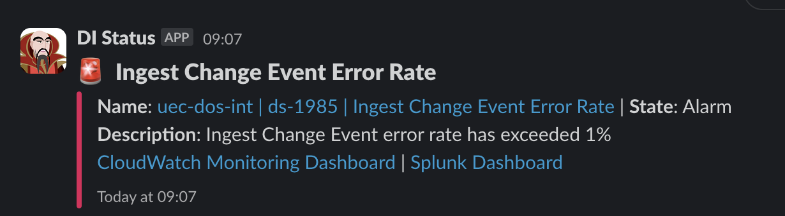

# Ingest change event lambda issue

## Table of contents

- [Ingest change event lambda issue](#ingest-change-event-lambda-issue)
  - [Table of contents](#table-of-contents)
  - [Description](#description)
  - [How did the development team discover the issue?](#how-did-the-development-team-discover-the-issue)
  - [Steps to gain more information about the issue](#steps-to-gain-more-information-about-the-issue)
  - [Application features to ensure data integrity](#application-features-to-ensure-data-integrity)
  - [How to fix the issue](#how-to-fix-the-issue)

## Description

This is a breaking issue within the ingest change event lambda.

Examples of an issue could be:

- Incorrect environment variables
- Incorrect lambda permissions
- The lambda isn't able to save change events to the AWS DynamoDB database
- The lambda isn't able to send change events to the AWS SQS queue

## How did the development team discover the issue?

A slack alert arrived in the development team slack channel with the following message:
`Ingest Change Event Error Rate`

## Steps to gain more information about the issue

- Check the CloudWatch Dashboard for the ingest change event lambda error rate
- Check the CloudWatch Logs for the ingest change event lambda
- Check the CloudWatch Log Insights Errors query, then look for the ingest change event lambda errors

## Application features to ensure data integrity

- The ingest change event lambda is idempotent, so change events can be retried without any issues
- Failed change events automatically are retried 3 times, before being sent to the dead letter queue. This queue is subscribed by the change event DLQ handler lambda, which saves the change events to the AWS DynamoDB database.
  - Once the issue is fixed, the change events can be reprocessed by the development team using the event replay lambda.

## How to fix the issue

1. Diagnose the issue using the steps preceding under the "Steps to gain more information about the issue" section
2. Fix the issue
3. Reprocess the failed change events using the event replay lambda
