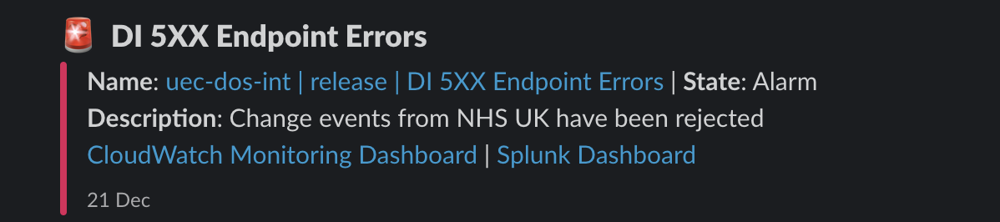

# API gateway 5XX issue

## Table of contents

- [API gateway 5XX issue](#api-gateway-5xx-issue)
  - [Table of contents](#table-of-contents)
  - [Description](#description)
  - [How did the development team discover the issue?](#how-did-the-development-team-discover-the-issue)
  - [Steps to gain more information about the issue](#steps-to-gain-more-information-about-the-issue)
  - [How to fix the issue](#how-to-fix-the-issue)

## Description

This is a breaking issue with the API Gateway. Which would only occur during deployment of the API Gateway.

Examples of an issue could be:

- API Gateway incorrectly configured
- Incorrect API Gateway permissions
- The API Gateway isn't able to send change events to the AWS SQS queue

## How did the development team discover the issue?

A slack alert arrived in the development team slack channel with the following message:
`DI 5XX Endpoint Errors`

Deployment team would notice the issue on the CloudWatch Dashboard for the application.

## Steps to gain more information about the issue

- Review the API Gateway CloudWatch Execution Logs
- Review the API Gateway CloudWatch Access Logs

## How to fix the issue

A potential quick fix that may resolve the issue is to redeploy the API Gateway using the API Gateway console. If this doesn't resolve the issue, then follow the steps below:

1. Diagnose the issue using the steps preceding under the "Steps to gain more information about the issue" section
2. Fix the issue
3. Monitor the API Gateway responses to ensure the issue has been resolved
